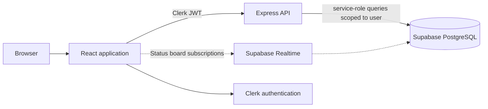

# FutureTracker

FutureTracker is a full-stack career-application workspace for students and early-career professionals. It brings post-application internship tracking, hackathons, interview preparation, documents, and application insights into one focused workflow.

[Live app](https://futuretracker.online) · [API health](https://futurestack-aeyn.onrender.com/api/v1/health) · [Documentation](docs/DOCUMENTATION.md) · [Contributing](CONTRIBUTING.md)

## Project status

The core product is actively implemented and includes opportunity tracking, protected sharing, interview workflows, document management, analytics, and a light/dark theme. The AI Resume Checker pipeline is implemented on the backend, but its frontend entry points are currently disabled behind a feature flag while rollout readiness is completed. See [the project status](docs/PROJECT_STATUS.md) for the authoritative feature matrix.

## What it does

- Track internships from application date to final outcome, and track hackathons through submission.
- Manage upcoming interview rounds and hackathon submission deadlines in the dashboard, calendar, Kanban board, and PDF reports.
- Record multi-round interview progress, including an optional scheduled time, and keep the parent opportunity status in sync.
- Prepare for internship interviews with research, questions, technical topics, STAR stories, and reflections.
- Store resumes, cover letters, and external links; associate them with opportunities and receive local ATS-style guidance for PDF and DOCX uploads.
- Collaborate on hackathons with account-backed owner/editor/viewer access, expiring single-use invites, an idempotent idea-vote model, tasks, and a submission checklist.
- Generate durable in-app hackathon-submission reminders through a transactional outbox. The free GitHub Actions dispatcher is optional and best-effort, not a strict-timing service; an optional Resend channel is disabled by default and runs only in that dispatcher.
- Create revocable, optional-passcode, read-only share links without requiring viewers to sign in.
- Explore funnel, hackathon-submission, status, and rejection insights.

The applied-date, scheduled-time, and hackathon-only reminder semantics are migration-gated. Apply [`20260716110000_rounds_drive_active_events.sql`](supabase/migrations/20260716110000_rounds_drive_active_events.sql) before deploying those API and frontend changes to an existing database.

## Stack

| Area | Technologies |
| --- | --- |
| Frontend | React 19, React Router 7, Tailwind CSS, Framer Motion, Recharts |
| API | Node.js, Express, Joi validation, Helmet, rate limiting |
| Identity and data | Clerk, Supabase PostgreSQL, Row-Level Security, Supabase Realtime |
| Documents and AI | pdfjs-dist, mammoth, pdf-parse, Vercel AI SDK, Gemini or Ollama |
| Delivery and observability | Vercel, Render, PostHog, GitHub Actions |

## Architecture



The browser uses `src/services/api.js` for application data. Direct Supabase CRUD from the frontend is prohibited; the one exception is a realtime subscription used to refresh the status board. See [the codebase guide](docs/CODEBASE_GUIDE.md) for the request flow and file map.

## Quick start

### Prerequisites

- Node.js 20 or later
- A Clerk application
- A Supabase project

### Install and run

```bash
git clone https://github.com/Venkat-Kolasani/FutureStack.git
cd FutureStack
npm install
(cd backend && npm install)

cp .env.example .env
cp backend/.env.example backend/.env
```

Set the required Clerk and Supabase values in both files, then run the API and client in separate terminals:

```bash
cd backend && npm run dev
```

```bash
npm start
```

The client runs at `http://localhost:3000`; the API runs at `http://localhost:3001`.

## Configuration

The checked-in templates are the complete configuration reference: [`.env.example`](.env.example) and [`backend/.env.example`](backend/.env.example).

| File | Required values |
| --- | --- |
| `.env` | `REACT_APP_CLERK_PUBLISHABLE_KEY`, `REACT_APP_API_URL`, `REACT_APP_SUPABASE_URL`, `REACT_APP_SUPABASE_ANON_KEY` |
| `backend/.env` | `CLERK_SECRET_KEY`, `SUPABASE_URL`, `SUPABASE_SERVICE_ROLE_KEY`, `CORS_ORIGIN` |

For production, set Vercel's build-time `REACT_APP_API_URL` to `https://futurestack-aeyn.onrender.com/api/v1` and redeploy the frontend. Also set `CLERK_JWT_PUBLIC_KEY` for local JWT verification. Share links need `SHARE_LINK_ENCRYPTION_KEY`. Account invites use `FRONTEND_URL`; the optional reminder dispatcher uses `JOB_DISPATCH_TOKEN`, with `JOB_ADMIN_USER_IDS` controlling the dead-letter view. Optional Resend delivery is backend-only: after applying its migration, set `REMINDER_EMAILS_ENABLED=true`, `RESEND_API_KEY`, and `REMINDER_EMAIL_FROM` on Render. The optional AI pipeline is configured only in `backend/.env` with `RESUME_AI_ENABLED`, provider/model values, and either a server Gemini key or user-managed BYOK settings. Never expose service-role, Clerk secret, job-dispatch, Resend, or AI keys in frontend variables.

## Database setup

Apply the SQL files in the following order to a new Supabase project:

1. [`docs/supabase-schema.sql`](docs/supabase-schema.sql)
2. [`docs/opportunity-campus-mode-migration.sql`](docs/opportunity-campus-mode-migration.sql)
3. [`docs/documents-migration.sql`](docs/documents-migration.sql)
4. [`docs/opportunity-rounds-migration.sql`](docs/opportunity-rounds-migration.sql) and [`docs/opportunity-rounds-round-types-patch.sql`](docs/opportunity-rounds-round-types-patch.sql)
5. [`docs/interview-prep-migration.sql`](docs/interview-prep-migration.sql)
6. [`docs/hackathon-collaboration-migration.sql`](docs/hackathon-collaboration-migration.sql)
7. [`docs/share-links-migration.sql`](docs/share-links-migration.sql), then the SQL files in [`supabase/migrations`](supabase/migrations) in timestamp order
8. The July 16 migrations in timestamp order: [`20260716081332_idempotent_idea_votes.sql`](supabase/migrations/20260716081332_idempotent_idea_votes.sql), [`20260716082400_transactional_reminder_outbox.sql`](supabase/migrations/20260716082400_transactional_reminder_outbox.sql), [`20260716083209_team_memberships_and_invites.sql`](supabase/migrations/20260716083209_team_memberships_and_invites.sql), [`20260716100000_review_hardening.sql`](supabase/migrations/20260716100000_review_hardening.sql), [`20260716110000_rounds_drive_active_events.sql`](supabase/migrations/20260716110000_rounds_drive_active_events.sql), [`20260716120000_optional_email_reminders.sql`](supabase/migrations/20260716120000_optional_email_reminders.sql), and [`20260716123000_user_notification_preferences.sql`](supabase/migrations/20260716123000_user_notification_preferences.sql)
9. [`docs/ai-tables-setup.sql`](docs/ai-tables-setup.sql) only when enabling the AI Resume Checker

Each migration enables and scopes Row-Level Security policies. Review them before applying in a production project.

### Optional free Resend reminders

1. Apply [`20260716120000_optional_email_reminders.sql`](supabase/migrations/20260716120000_optional_email_reminders.sql) and [`20260716123000_user_notification_preferences.sql`](supabase/migrations/20260716123000_user_notification_preferences.sql) after the existing reminder-outbox migrations.
2. In the [Resend API Keys dashboard](https://resend.com/api-keys), select **Create API Key**, name it `FutureStack Render production`, choose **Sending access**, and restrict it to the verified sender domain. Copy the `re_...` value immediately: Resend shows it only once.
3. In Render, add `REMINDER_EMAILS_ENABLED=true`, `RESEND_API_KEY`, and `REMINDER_EMAIL_FROM=FutureStack <your-verified-domain>`. Redeploy the API. Do not add these to Vercel.
4. Keep the GitHub Actions reminder dispatcher configured. It wakes the existing outbox; it does not send email directly. Each signed-in user chooses **Email deadline reminders** from the bell icon's Notifications page; the default is off until they opt in.

The implementation is intentionally best-effort: an email provider error retries through the existing job lease, and a per-job record plus Resend idempotency protects duplicate sends. See [`docs/DOCUMENTATION.md`](docs/DOCUMENTATION.md), [ADR-007](docs/adr/ADR-007-optional-email-reminders.md), and [ADR-008](docs/adr/ADR-008-user-controlled-email-reminders.md) for the limits and scale path.

## Validation and tests

```bash
npm run test:ci
npm run build
npm run check:architecture
(cd backend && npm test)
```

The architecture check protects the frontend/API boundary. Feature-specific commands and smoke tests are documented in [docs/TESTING.md](docs/TESTING.md).

## API overview

All endpoints except health checks and public-share reads require a Clerk bearer token. Canonical endpoints use `/api/v1`; the legacy `/api` prefix is temporarily supported with `Deprecation` and `Sunset` headers.

| Area | Prefix |
| --- | --- |
| Health | `/api/v1/health`, `/api/v1/health/deps` |
| Opportunities and interview rounds | `/api/v1/opportunities` |
| Analytics | `/api/v1/analytics` |
| Documents and ATS fields | `/api/v1/documents` |
| Interview preparation | `/api/v1/interview-prep` |
| Hackathon collaboration | `/api/v1/hackathons` |
| Authenticated share links | `/api/v1/share-links` |
| Public share reads | `/api/v1/public/share-links` |
| AI resume checks | `/api/v1/documents/:id/ai-check` |
| AI provider settings | `/api/v1/ai-settings` |
| In-app notifications | `/api/v1/notifications` |

The complete endpoint list, request expectations, and curl examples are in [backend/README.md](backend/README.md).

Current production checks: [liveness](https://futurestack-aeyn.onrender.com/api/v1/health) and [dependencies](https://futurestack-aeyn.onrender.com/api/v1/health/deps).

## Documentation

| Document | Use it for |
| --- | --- |
| [Project status](docs/PROJECT_STATUS.md) | Current shipped, gated, and planned capabilities |
| [Codebase guide](docs/CODEBASE_GUIDE.md) | Routes, service objects, request flow, and contribution orientation |
| [Architecture guide](docs/DOCUMENTATION.md) | System design and deployment model |
| [Architecture decisions](docs/adr/README.md) | Decision records and interview-ready trade-offs |
| [Testing guide](docs/TESTING.md) | Commands, focused test suites, and manual checks |
| [Security guide](docs/SECURITY.md) | Deployment controls and security assumptions |
| [Interview rounds](docs/interview-rounds.md) | Multi-round pipeline and parent-status synchronization |
| [Interview preparation](docs/interview-prep.md) | Prep workspace data model and API |
| [Documents and ATS](docs/documents-and-ats.md) | Document vault and local ATS scoring |
| [Share links](docs/share-links.md) | Privacy model and public-link verification |
| [AI Resume Checker](docs/ai-resume-checker.md) | Gated pipeline, providers, and rollout requirements |
| [Roadmap](docs/future.md) | Future work and technical priorities |

Historical planning material under `docs/issues/` records the original delivery slices; it is not a statement of the current product state.

## Contributing

Please read [CONTRIBUTING.md](CONTRIBUTING.md) before selecting an issue or opening a pull request. Keep contributions focused, add tests for route and validation changes, and do not commit secrets.
