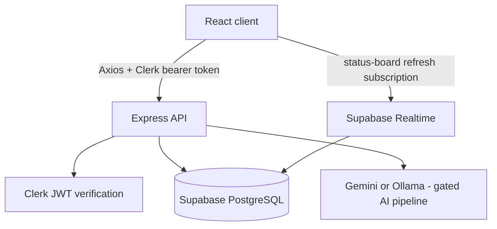

# FutureTracker Architecture Guide

Last reviewed: July 15, 2026

FutureTracker is a React single-page application backed by an Express API. It is designed around a simple boundary: the client renders the product and sends authenticated requests; the API enforces access, validation, and business rules before working with Supabase.

For current feature availability, use [PROJECT_STATUS.md](PROJECT_STATUS.md). For a route-by-route orientation, use [CODEBASE_GUIDE.md](CODEBASE_GUIDE.md).

## System design



### Client

- `src/App.js` supplies routing, protected pages, error boundaries, theme context, Clerk styling, lazy loading, and page analytics.
- `src/services/api.js` is the single application-data client. Pages and components should call exported services instead of constructing HTTP URLs.
- `src/lib/supabase.js` supports realtime refreshes only. Application CRUD belongs in the Express API.
- `src/context/ThemeContext.jsx` persists the light/dark preference and applies the document theme class.

### API

- `backend/src/app.js` configures Helmet, CORS, JSON limits, sanitization, general/write rate limits, health endpoints, protected route mounts, and error responses.
- `backend/src/middleware/auth.js` verifies Clerk identity and resolves the internal user identifier used by handlers.
- Request schemas live under `backend/src/validation/`; route handlers use validation middleware before database calls.
- Supabase service-role access is confined to `backend/src/lib/supabase.js` and API handlers scope queries to the authenticated internal user.

## Product domains

| Domain | Client area | API area | Data/migration reference |
| --- | --- | --- | --- |
| Opportunities | Dashboard, lists, status board, calendar, reports | `routes/opportunities.js` | `supabase-schema.sql` |
| Interview rounds | Opportunity detail, timeline, modal | `routes/opportunity-rounds.js` | `opportunity-rounds-migration.sql` |
| Interview preparation | `InterviewPrepDetail` and panels | `routes/interview-prep.js` | `interview-prep-migration.sql` |
| Documents and ATS | Documents page and components | `routes/documents.js` | `documents-migration.sql` |
| Hackathon collaboration | `HackathonDetail` and panels | `routes/hackathons.js` | `hackathon-collaboration-migration.sql` |
| Share links | Dashboard sharing controls and `PublicSharePage` | share-link route modules | `share-links-migration.sql` and `supabase/migrations/` |
| AI Resume Checker | Document components, currently gated | `routes/resume-checker.js`, `routes/ai-settings.js` | `ai-tables-setup.sql` |

## Security model

1. Clerk authenticates the user and the API verifies the bearer token.
2. API handlers derive user context from `req.auth`; clients do not send a trusted `user_id`.
3. Supabase tables use Row-Level Security policies as defense in depth, while service-role API queries are explicitly user-scoped.
4. Public shares are snapshots, not raw dashboard access. Tokens are stored as hashes and recoverable copies are encrypted; passcodes are verified server-side.
5. The AI pipeline is opt-in at deployment and feature-flagged in the UI. User-managed keys are encrypted at rest when configured.

Deployment controls, limitations, and operational guidance are maintained in [SECURITY.md](SECURITY.md).

## Development and verification

```bash
# root
npm run test:ci
npm run build
npm run check:architecture

# backend
cd backend && npm test
```

GitHub Actions runs the frontend build/tests, backend tests, architecture check, and non-blocking dependency audits on pushes and pull requests to `main`. See [TESTING.md](TESTING.md) for focused suites and manual acceptance checks.

## Deployment configuration

The frontend is configured for Vercel and the API for Render, but the code can be deployed to equivalent platforms. Required values are kept in [`.env.example`](../.env.example) and [`backend/.env.example`](../backend/.env.example); do not duplicate secrets in documentation or client variables.

For production:

- Set `CORS_ORIGIN` to the exact frontend origin or a comma-separated allowlist.
- Set `CLERK_JWT_PUBLIC_KEY` to avoid dependency on remote JWKS fetching during every verification path.
- Set `SHARE_LINK_ENCRYPTION_KEY` before enabling share links.
- Keep `RESUME_AI_ENABLED=false` until the provider, spend limits, privacy review, and monitoring are ready; separately enable the frontend feature flag only as part of that rollout.

## Further reading

- [Codebase guide](CODEBASE_GUIDE.md)
- [Project status](PROJECT_STATUS.md)
- [Testing](TESTING.md)
- [Security](SECURITY.md)
- [Roadmap](future.md)
