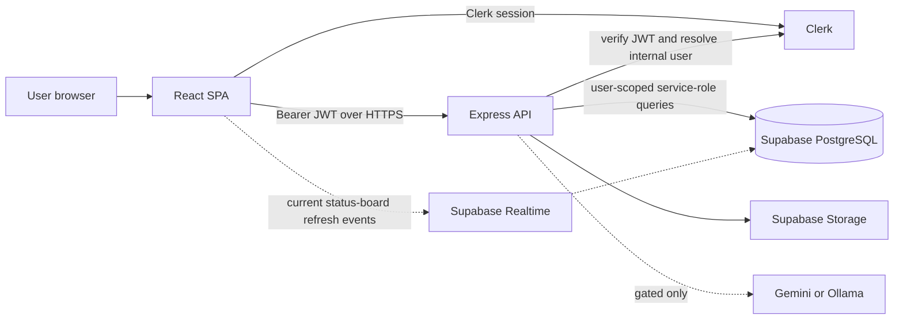
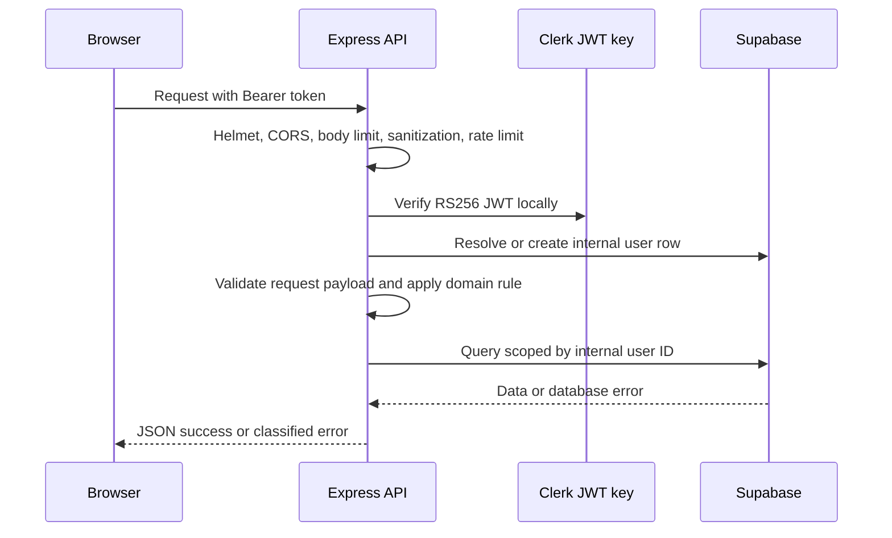
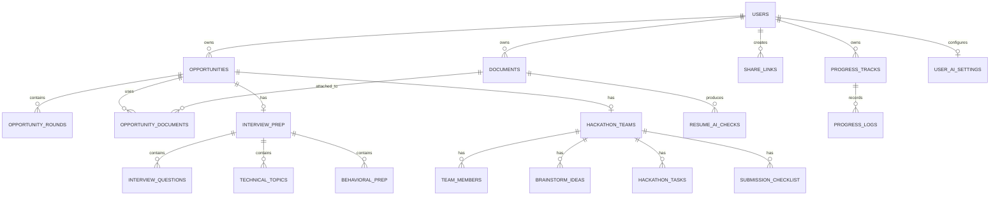
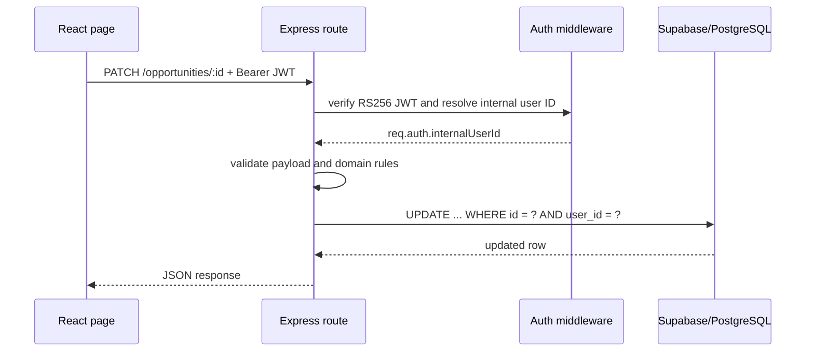

# FutureTracker: Interview Preparation Guide

Last reviewed against the repository: July 15, 2026

This is the single, interview-focused source of truth for FutureTracker. It explains what the product does, how the current implementation works, why the important choices were made, the trade-offs they create, and how the design would evolve for millions of users. It is deliberately candid: a strong interview answer distinguishes shipped behavior from a production-scale plan.

## 1. The 60-second answer

**FutureTracker is a full-stack career-application workspace for students and early-career professionals.** It lets a user manage internships and hackathons, track deadlines on a calendar and Kanban board, record multi-round interviews, prepare for interviews, manage application documents, view analytics, collaborate on hackathons, and selectively share a read-only progress snapshot.

The application is a React single-page app backed by an Express API. Clerk handles identity; the API validates Clerk JWTs and enforces user ownership; Supabase provides PostgreSQL, storage, and limited realtime refreshes. I chose an API boundary rather than frontend database CRUD so authentication, validation, business rules, and sensitive operations are centralized. The design is intentionally modular: each domain has a route module, validation schemas, focused UI components, migration SQL, and tests.

The most important engineering trade-offs are:

- Supabase and Clerk made it possible to ship safely and quickly without building identity or database infrastructure from scratch.
- Express gives direct control over validation and authorization, but the current single-process API and in-memory user cache are not sufficient for horizontal scale.
- The status board uses realtime notifications followed by an API refetch. That is simple and correct for the current scale, but should become filtered broadcast events or a server-mediated event stream before broad production rollout.
- The AI Resume Checker is implemented but UI-gated. This avoids silently taking on LLM cost, privacy, latency, and reliability risks before its rollout controls are complete.

## 2. Product problem and user journey

### Problem

Career applications are fragmented across job boards, messages, spreadsheets, documents, deadlines, and interview notes. A student managing many applications needs one private workspace that answers:

- What have I applied to, and what needs action next?
- Which resume or cover letter did I submit?
- Where am I in each interview pipeline?
- How is my application funnel changing over time?
- How can I safely share progress with a mentor without exposing my account?

### Primary user flow

1. A user signs in with Clerk.
2. They add an internship or hackathon with title, link, deadline, status, notes, and campus mode.
3. The dashboard, calendar, list, and Kanban board present the same opportunity data in different task-oriented views.
4. For an internship, the user can add interview rounds and preparation material. Round outcomes synchronize the parent opportunity status.
5. The user uploads or links a resume/cover letter, receives client-side ATS-style feedback for supported files, and assigns documents to applications.
6. For a hackathon, the user maintains team members, brainstormed ideas, tasks, and a submission checklist.
7. The user can generate an expiring, revocable, optionally passcode-protected read-only snapshot for a mentor or recruiter.

### Current feature status

| Capability | Current state | Important interview detail |
| --- | --- | --- |
| Opportunity CRUD, dashboard, calendar, reports, analytics | Available | All application data mutations go through the Express API. |
| Light and dark theme | Available | Theme preference is managed in React context and applied to Clerk appearance as well as app UI. |
| Interview rounds and preparation | Available | Rounds are internship-only and synchronize derived parent fields server-side. |
| Documents and ATS hints | Available | ATS analysis is rule-based and runs in the browser; it is not an official ATS score. |
| Hackathon collaboration | Available | Team, members, ideas/votes, tasks, and checklist are separate, user-owned resources. |
| Read-only share links | Available | A stored snapshot is shared, not live dashboard access. Links can expire, be revoked, and require a passcode. |
| AI Resume Checker | Implemented, UI-gated | Backend pipeline, storage, provider settings, tests, and UI components exist; `AI_RESUME_CHECK_ENABLED` is currently `false`. |
| Progress Logger | Schema migration ready | Tracks and daily logs, indexes, and Clerk-compatible RLS are defined; API and UI remain separate follow-on work. |
| Reminders, tags, bulk import/export, advanced filters | Planned | These are intentionally not claimed as shipped features. |

## 3. System architecture



### Why this architecture?

| Choice | Why it was chosen | Trade-off |
| --- | --- | --- |
| React single-page application | Fast, responsive interaction for a personal workspace; components naturally map to product domains. | Initial JavaScript cost and client state complexity; authenticated routes are lazy-loaded to reduce initial work. |
| Express API | Centralizes authorization, validation, ownership checks, audit-oriented logging, rate limits, and business rules. | Requires separate API deployment and operational ownership. |
| Clerk | Avoids building credential storage, OAuth, sessions, and token issuance. | Adds vendor dependency and requires correct JWT-key configuration. |
| Supabase PostgreSQL | Provides managed relational data, storage, RLS, migrations, and realtime primitives. | Service-role use must be tightly controlled; schema and RLS changes are security-sensitive. |
| REST over a separate API | Clear resources and predictable debugging for CRUD-oriented domains. | Some multi-resource screens require several endpoints; a BFF aggregation layer may be useful later. |
| Vercel AI SDK with Gemini/Ollama | Provider abstraction permits a hosted or local model option. | LLM calls are slow, variable, and costly, so the feature is gated. |

### Deployment shape today

- Frontend: React app intended for Vercel.
- API: Express service intended for Render.
- Identity: Clerk.
- Database, storage, and optional realtime: Supabase.
- Product analytics: PostHog when configured.
- CI: GitHub Actions runs frontend build/tests, backend tests, architecture guardrails, and non-blocking dependency audits.

The exact environment contract lives in `.env.example` and `backend/.env.example`. Secrets are backend-only; the browser receives only public configuration such as Clerk's publishable key and Supabase's anon key.

## 4. Frontend architecture

### Application composition

`src/App.js` is the composition root. It wires up:

- `HelmetProvider` for document metadata.
- `ThemeProvider` for persisted light/dark preference.
- `ClerkProvider`, including matching Clerk appearance tokens.
- `ErrorBoundary` for unexpected render failures.
- React Router routes and `ProtectedRoute` wrappers.
- A global toast container and page-view tracking.
- `Suspense` and route-level lazy loading for authenticated pages.

The landing page loads immediately; heavier authenticated pages such as Dashboard, Analytics, Documents, and Hackathon Detail are loaded on demand. This was a deliberate performance choice because the landing route is the most common first visit.

### Data access rule

`src/services/api.js` is the frontend's application-data boundary. It creates Axios clients, attaches a Clerk bearer token to protected requests, maps common HTTP errors to user-facing messages, and exports service objects such as `opportunityService`, `documentService`, `roundService`, and `shareLinkService`.

**Why not query Supabase directly from every component?** It would distribute authorization logic and make validation, rate limiting, audit logging, and future backend changes much harder to enforce consistently. The repository's architecture check guards against direct frontend Supabase CRUD.

### State and UI decisions

- Local component state and hooks are sufficient for the current app; there is no global Redux-like store because most data is page/domain scoped.
- `useAuthToken` registers a token getter once so the API client obtains fresh Clerk JWTs rather than storing a raw token in browser state.
- `ThemeContext` owns the theme preference; individual components consume a boolean instead of duplicating persistence logic.
- Shared components standardize cards, buttons, modals, loading, empty states, error handling, navigation, and status indicators.
- `react-toastify` provides consistent asynchronous feedback; the Axios response interceptor maps network, auth, validation, availability, and server failures to useful messages.

### Current realtime behavior and honest limitation

The Status Board subscribes to Supabase `postgres_changes` for the `opportunities` table. On any event it refetches the user's opportunities through the API. That avoids trying to merge database event payloads into client state and makes the API the source of rendered truth.

This is acceptable for a small product but is not the final production design:

- The subscription is broad rather than explicitly filtered by user in the client code.
- Refetching the whole list per event does not scale with high write volume or large portfolios.
- Realtime authorization and database publication policies must be reviewed together; changing RLS or delivery settings can break the current approach.

For scale, I would publish a small, user-scoped event from the API after a committed mutation, use Supabase Broadcast or a dedicated websocket service, include an entity/version in the payload, and update or invalidate only the affected query. That preserves isolation and reduces needless reads.

## 5. Backend request lifecycle



### Middleware order and responsibility

`backend/src/app.js` configures:

1. `trust proxy` for reverse-proxy-aware request data.
2. Helmet headers, including CSP, HSTS, frame protection, `nosniff`, and a referrer policy.
3. CORS using a comma-separated allowlist from `CORS_ORIGIN`.
4. A 1 MB JSON body limit and input sanitization.
5. General rate limiting: 2,000 requests per 15 minutes per IP, excluding liveness health checks.
6. Write rate limiting: 1,500 mutating requests per 15 minutes per IP.
7. Request/response logging for write operations.
8. Public health routes, protected route mounts, a 404 handler, and centralized error fallback.

These limits are deliberately generous for a personal productivity app. They are a first abuse-control layer, not a complete DDoS or multi-region rate-limiting solution.

### Authentication and internal identity

`backend/src/middleware/auth.js`:

- Extracts the `Authorization: Bearer <token>` header.
- Verifies the token locally with the Clerk RS256 public key from `CLERK_JWT_PUBLIC_KEY`.
- Uses the token subject as the external Clerk identity.
- Resolves that subject to an internal `users.id` UUID in Supabase, creating the row on first login.
- Stores that UUID on `req.auth.internalUserId`; protected handlers use it for ownership scoping.

**Why both Clerk ID and internal UUID?** Clerk remains the identity provider, while a stable internal UUID makes relational foreign keys and database ownership simple. The API never trusts a user ID supplied by the client.

**First-login race condition:** concurrent first requests can both try to insert a user row. The code handles PostgreSQL's unique-constraint error by reading the row that won the race.

**Current trade-off:** internal-user lookups are cached in a process-local `Map` for five minutes. This saves database lookups on one instance, but the cache disappears on restart and is not shared across instances. At scale I would use a shared cache such as Redis or remove the lookup from the hot path through a reliable identity-provisioning/webhook design.

### Validation and error semantics

Route request schemas live under `backend/src/validation/` and are applied through `middleware/validate.js`. Validation is done before database mutation. The API uses meaningful classes of response:

| Status | Meaning in this project |
| --- | --- |
| 401 | Missing, invalid, or expired bearer token |
| 403 | Caller is authenticated but cannot access the resource |
| 404 | Route or scoped resource does not exist |
| 422 | Request data fails validation |
| 429 | General, write, public-share, or AI limit reached |
| 500 | Unexpected application error |
| 503 | A dependency/auth bootstrap is unavailable or health checks are degraded |

The browser treats these differently so an outage is not misleadingly shown as a session-expiry problem.

## 6. Data model and ownership

### Core relational model



**How to draw this in an interview:** start with `Users → Opportunities` as the centre. Add the many-to-many document relationship using `opportunity_documents`; that demonstrates normalization. Then branch to interview rounds/prep for internships and a one-to-one hackathon team for hackathons. Add share links as a user-owned snapshot, not a relationship from a public viewer to private data. Do not try to draw every column unless asked.

### Important tables

| Table/group | Purpose | Design reason |
| --- | --- | --- |
| `users` | Maps Clerk subject to internal UUID and profile data. | Separates external identity from relational ownership. |
| `opportunities` | Core internship/hackathon record, status, dates, notes, campus mode, derived round fields. | One canonical entity serves every product view. |
| `opportunity_rounds` | Ordered interview stages and results. | A normalized child collection avoids hard-coding a fixed number of interview columns. |
| `documents` and `opportunity_documents` | User documents and many-to-many assignments. | A document can be reused across applications. |
| Interview-prep tables | Research, question bank, technical topics, and behavioral STAR records. | Structured prep data is easier to extend and query than one unbounded blob. |
| Hackathon collaboration tables | Team, members, ideas, tasks, and checklist items. | Distinct resources allow independent CRUD and validation. |
| `share_links` | Snapshot metadata, hashed token, encrypted recoverable token, passcode data, expiry, status, and views. | Sharing is isolated from live dashboard authorization. |
| `resume_ai_checks`, `user_ai_settings` | Persisted AI result and encrypted per-user settings. | AI runs can be shown later without repeating paid work. |
| `progress_tracks`, `progress_logs` | User-owned learning tracks and one daily log per track, with flexible track-specific JSON metadata. | The normalized track/log relationship supports history and yearly heatmaps without a table per learning template. |

### Why PostgreSQL and migrations?

The product has clear relationships, ownership boundaries, constraints, and reporting needs. PostgreSQL fits this better than an unstructured document store. SQL migrations under `docs/` and `supabase/migrations/` record schema evolution, indexes, RLS policies, and triggers. They must be reviewed like application code because an incorrect policy can expose data.

### Row-Level Security and service role

RLS is enabled on user-owned tables as defense in depth. In the current server-side design, the API uses a Supabase service-role client, which bypasses RLS. Therefore the primary runtime protection is explicit user scoping in each API query, with RLS protecting against accidental direct database access and future client paths.

The correct interview answer is not “RLS alone secures everything.” It is: **the API derives identity from a verified JWT, scopes every service-role query to that identity, and RLS is a second layer that must be tested and reviewed with each migration.**

### DBMS concepts to name confidently

| Concept | How FutureTracker uses it | Interview-ready explanation |
| --- | --- | --- |
| Normalization | Documents are separate from opportunities; `opportunity_documents` is a junction table. Interview rounds are child rows rather than `round_1`, `round_2`, and so on. | This avoids repeated data, supports reuse, and allows an unbounded number of rounds/documents without schema changes. |
| 1NF, 2NF, 3NF | Columns are atomic; many-to-many data is split into a junction table; child data depends on its own primary key and parent FK rather than unrelated fields. | The aim was practical third-normal-form design, not normalization for its own sake. I denormalize only derived fields that improve the product flow. |
| Primary/foreign keys | UUID primary keys; foreign keys tie every owned row to a user, opportunity, document, prep record, or team. | FKs make relationships explicit and prevent orphaned records. |
| Cascading deletes | Child resources use `ON DELETE CASCADE` where their parent owns their lifecycle. | Deleting an opportunity should not leave rounds, prep, or document links that no longer have a meaning. |
| Constraints | `CHECK` constraints limit categories, statuses, and campus modes; `UNIQUE` prevents duplicate Clerk identities, document links, and one-to-one prep/team records. | Important invariants live in the database as well as API validation. |
| Indexes | The core schema indexes Clerk IDs, user IDs, category, status, and deadlines. | Indexes are selected for known ownership/filter patterns; at scale I would add measured composite indexes beginning with `user_id`. |
| ACID and transactions | PostgreSQL provides transactional primitives, but not every current multi-step route is wrapped in an explicit application transaction. | For a production multi-write workflow—for example a round mutation plus parent sync—I would use an explicit transaction or database function so partial success cannot leave inconsistent state. |
| Isolation | User-scoped queries and database constraints prevent most logical conflicts; first-login creation explicitly handles a unique-key race. | For concurrent updates to the same resource, I would add optimistic versioning or transaction locking only when real conflict patterns justify it. |
| RLS | Policies limit direct row access as defence in depth. | Service-role access bypasses RLS, so verified API ownership checks remain essential. |

## 6.1 Interview diagram pack

If an interviewer asks you to draw, use one of these three diagrams. State the scope before drawing: “I’ll draw the current implementation first, then mark what I would change for scale.”

### A. High-level architecture

Use the architecture diagram in [System architecture](#3-system-architecture). Draw five boxes in this order: Browser/React → Express API → Clerk and Supabase; then add Storage and the gated AI provider as external dependencies. Label the API connection “HTTPS + bearer JWT” and the database connection “user-scoped server query.”

### B. Request sequence

Use this compact write path when asked how a mutation is secured:



The important line to say aloud is the database predicate: authorization is enforced at the data access point, not only in the UI.

### C. ER diagram

Use the ER diagram above. Explain cardinality: a user has many opportunities; an opportunity has many rounds; documents and opportunities are many-to-many; one opportunity has at most one prep workspace or hackathon team; a team has many members/tasks/ideas/checklist items.

## 6.2 OOP and frontend design concepts

FutureTracker is written in JavaScript/React and deliberately favors **functional components and composition** over a class-heavy inheritance hierarchy. That is an informed OOP answer, not an absence of design.

| OOP concept | Where it appears | How to explain it |
| --- | --- | --- |
| Encapsulation | `opportunityService`, `shareLinkService`, auth middleware, `syncOpportunityFromRounds`, and reusable UI components hide implementation details behind narrow interfaces. | A page asks a service to update an opportunity; it does not know Axios headers, token handling, or route construction. |
| Abstraction | A `DocumentCard`, `Modal`, or API service exposes the behaviour a caller needs without exposing internal rendering/network details. | Abstractions reduce coupling and make implementation changes local. |
| Composition | Pages compose domain-specific panels and common components; a hackathon is an opportunity plus specialized collaboration resources. | Composition is more flexible than deep inheritance and maps naturally to React. |
| Polymorphism through props | Shared buttons, cards, modals, and status components change behaviour/style through props. | The caller uses the same component contract with different data or variants. |
| Separation of concerns | Routes own HTTP/domain orchestration, validation owns input shape, library helpers own pure rules, and components own rendering/interactions. | This gives each unit a reason to change and makes testing focused. |
| Inheritance, intentionally limited | Modern React does not require class inheritance for reuse. | I prefer composition because it avoids fragile base classes and makes domain boundaries explicit. |

Useful example: `syncOpportunityFromRounds` is effectively a pure domain-rule module. It receives rounds and existing status and returns derived fields. That makes it easy to unit test without React, HTTP, or the database.

## 6.3 Networking and computer-network concepts

| Concept | Current use | Nuanced interview answer |
| --- | --- | --- |
| Client-server model | React runs in the browser; Express exposes JSON APIs. | The client owns presentation and interaction; the server is the policy and data-access boundary. |
| HTTPS/TLS | Production hosting platforms terminate TLS for frontend/API endpoints. | TLS protects data in transit; it does not replace authorization or data isolation. |
| HTTP and REST | Resource-oriented URLs use `GET`, `POST`, `PATCH`/`PUT`, and `DELETE`. | `GET` is safe/read-only; clients can retry it more freely. Mutations require careful retry/idempotency design, especially for future queues/payments-like flows. |
| JWT bearer authentication | The browser obtains a Clerk token and sends it in `Authorization`; Express verifies RS256 locally. | A JWT proves a signed identity claim but must be verified for signature/expiry and never treated as a database authorization query by itself. |
| CORS | Express restricts browser origins through `CORS_ORIGIN`. | CORS is a browser-enforced cross-origin policy, not an authentication mechanism or server-to-server security control. |
| Reverse proxy | Express enables `trust proxy` because hosting sits behind a proxy. | This allows correct client/protocol interpretation; it must only trust known proxy infrastructure to avoid spoofed forwarding headers. |
| DNS/CDN | Vercel can serve frontend assets close to users; Render/Supabase/Clerk are managed external endpoints. | CDN helps static content latency; API and database performance still need independent capacity planning. |
| WebSocket/realtime | The status board currently subscribes to Supabase realtime then refetches through the API. | Realtime is useful for freshness, but delivery must be user-scoped, authenticated, observable, and backpressure-aware before high fan-out. |
| Timeouts/retries | Axios has a 15-second timeout; the UI classifies network and availability errors. | Retries should be bounded and idempotent; blindly retrying a non-idempotent POST can duplicate work. |
| Rate limiting | Express limits general and write traffic; AI has a stricter specialized limiter. | Current limits are per process/IP; at scale use shared/edge limits and user/tenant quotas. |

## 7. Domain logic worth explaining

### Opportunity tracking and analytics

Opportunity CRUD is the product's foundation. List, dashboard, calendar, board, reports, and analytics reuse the same canonical data rather than maintaining copies.

Analytics currently queries a user's opportunities and relevant interview rounds, then computes status counts, category/campus-mode counts, funnel metrics, weekly/monthly activity, deadline distribution, and interview-pipeline insights in the API process.

**Why this is fine now:** it keeps reporting logic easy to understand and test, avoids premature database complexity, and a single user's dataset is likely small.

**Why it is not enough later:** it pulls and iterates through all of a user's records on each analytics request. At larger data volumes, I would push grouped aggregates into PostgreSQL, add indexes that start with `user_id`, cache per-user results, and use precomputed/materialized views or event-driven rollups for expensive metrics.

### Interview rounds: one source of truth for status

Each internship has ordered rounds such as online assessment, technical, HR, and final. `syncOpportunityFromRounds.js` derives the parent opportunity state after a round mutation:

- A rejected round makes the opportunity `rejected` and records the rejected round number.
- A pending round makes it `interviewed` and records the current round number.
- A cleared final round makes it `selected`.
- Completed/skipped non-final rounds lead to `shortlisted` or `interviewed` depending on progress.

**Why derive instead of asking users to manually update both records?** Two editable sources would drift. Centralizing the derivation in the backend makes the timeline and Kanban board consistent. The mutation response returns the round, synchronized opportunity, and current rounds so the client can update immediately without redundant reads.

### Interview preparation

The preparation workspace is intentionally separate from the interview timeline. The timeline represents process state; prep represents work the candidate does around that process. It holds company research, questions, technical topics, behavioral STAR stories, and reflection. The backend rejects prep operations for non-internship opportunities because the feature is semantically scoped to interviews.

### Documents and ATS guidance

For PDF/DOCX documents, `atsScorer.js` extracts text in the browser using `pdfjs-dist` and `mammoth`, then applies transparent heuristics for sections, content density, contact information, and ATS-friendly length. The result is stored alongside the document.

This is intentionally labelled as guidance, not an official ATS score. A transparent rule-based score is fast, free, works offline from the API after the file is available, and gives deterministic feedback. It does not claim to reproduce a recruiter's or vendor ATS's ranking algorithm.

### AI Resume Checker: implemented but not released

The AI system is a server-side pipeline:

1. Load PDF/DOCX content from storage.
2. Extract text.
3. Ask an LLM to construct a structured resume.
4. Optionally enrich from public GitHub information.
5. Evaluate four evidence-backed categories and generate strengths, suggestions, evidence, and scores.
6. Persist the result in `resume_ai_checks`.

It supports Gemini and local Ollama through the Vercel AI SDK. A user-provided API key can be encrypted with AES-256-GCM at rest; the API returns only safe metadata such as a key suffix.

**Why keep it gated?** LLM calls are costly, variable, and slow (the current synchronous flow can take tens of seconds). Releasing it needs provider budgeting, abuse protection, privacy copy, monitoring, an asynchronous job experience, and a deliberate feature flag rollout. Code existing is not the same as a feature being production-ready.

### Hackathon collaboration

Hackathons are not modeled as a separate top-level product. They are opportunities with `category = hackathon`, which prevents duplicate deadline/status/reporting logic. Hackathon-specific collaboration is attached only where needed: team, members, idea board and votes, task board, and submission checklist.

This is a composition-over-duplication decision: shared lifecycle data remains in `opportunities`; specialized data is normalized into specialized tables.

### Read-only share links

Share links deliberately expose a **snapshot**, not live data or a recipient's access to the owner account. The server generates a 32-byte base64url token, stores a SHA-256 hash for lookup, and optionally stores an AES-256-GCM-encrypted copy so the owner can copy an active link again. Optional passcodes are hashed with PBKDF2 and verified with timing-safe comparison. The owner can control which fields appear, expire a link, or revoke it.

The public endpoint returns only the snapshot after token/passcode checks. This reduces the risk that a public page becomes an alternate route into the private dashboard.

## 8. Security posture

### Controls that exist now

- Clerk RS256 JWT verification occurs locally when `CLERK_JWT_PUBLIC_KEY` is configured; the API does not need a remote key fetch per request.
- Protected route handlers use the verified internal user ID, never a user ID supplied by the browser.
- Joi schemas validate request data at API boundaries.
- Helmet sets protective HTTP headers and CSP.
- CORS uses explicit origins from configuration.
- JSON bodies are limited to 1 MB and sanitized.
- General, write, public-share, and AI-specific rate limits exist.
- User-owned database tables have RLS policies.
- Share tokens are hashed; passcodes are salted and hashed; stored recoverable tokens and AI BYOK values are encrypted with authenticated encryption.
- No backend secrets are placed in `REACT_APP_*` variables.

### What I would not overclaim

- Process-local rate limiting is not enough when the API has multiple instances. It should move to a shared store such as Redis or an edge/API-gateway control.
- A service-role Supabase key is powerful. Its access should stay isolated to the server, and code review must verify every user scope.
- File uploads should gain malware scanning, file-type verification beyond extensions/MIME hints, size controls appropriate for the deployment, and quarantine behavior before enterprise rollout.
- Security logging should become structured, redacted, centrally retained telemetry rather than only process logs.
- Secret rotation needs a KMS/secret-manager plan. Encryption-key rotation must support decrypting existing ciphertext or re-encrypting it safely.

### Threat-model answers

| Interviewer question | Strong answer |
| --- | --- |
| “Can one user read another user's opportunities?” | The API derives the user from a verified Clerk JWT and filters every service-role query by that internal user ID. RLS is a second layer. I would add authorization tests for every route and audit new queries in review. |
| “What if a share URL leaks?” | It grants only the selected snapshot and fields, not account access. The owner can revoke it; it can expire; an optional passcode adds a second secret. For sensitive enterprise use, I would add access logs, stronger passcode policy, recipient identity, and short-lived signed access. |
| “How do you protect BYOK keys?” | Encrypt with AES-256-GCM on the server, retain IV/auth tag separately, never return the raw key, and prefer a dedicated encryption secret. At scale, use a cloud KMS envelope-encryption design and rotate keys. |
| “What happens when Supabase is down?” | Auth bootstrap recognizes network/database failures and returns 503 rather than incorrectly reporting a bad session. Health/dependency endpoints surface degraded state. The client shows a temporary-service error. |

## 9. Reliability, testing, and operations

### Tests that exist

The repository includes frontend tests for route/render behavior and pure helpers such as date, opportunity, and ATS scoring utilities. Backend tests cover health, opportunities, analytics, documents, interview prep, rounds, share links, validation middleware, round synchronization, AI key vault behavior, resume-agent logic, and GitHub enrichment.

Before a release or PR, the standard checks are:

```bash
npm run test:ci
npm run build
npm run check:architecture
(cd backend && npm test)
```

`check:architecture` enforces the frontend API boundary. Tests mock Clerk and Supabase, so they do not require live secrets. Manual smoke checks remain important for sign-in, pages changed, an expected error case, upload flows, public share behavior, and responsive UI.

### Observability today

- The API has health and dependency-health endpoints.
- Write requests emit JSON-shaped process logs.
- PostHog is optional for client product analytics.
- The UI has error boundaries, loading states, toasts, and a realtime connection indicator.

### Observability needed for a serious production service

I would add structured logs with correlation IDs, distributed traces from browser to API to database, error tracking, SLO-based dashboards, synthetic probes, and alerts on error rate, latency, queue age, dependency availability, and suspicious rate-limit patterns. I would keep PII out of logs and define retention and access policy.

## 10. Scaling path: current product to millions of users

“Millions of users” is not achieved by merely adding servers. The strategy is to remove state from the API, partition work by user/tenant, avoid full scans, make slow tasks asynchronous, and measure each layer.

| Area | Current approach | First production upgrade | Large-scale direction |
| --- | --- | --- | --- |
| API compute | One Express service can hold a local cache and limits. | Stateless containers behind a load balancer; environment-based configuration. | Horizontally autoscaled regional services, safe deploys, and request budgets. |
| Auth-user mapping | Five-minute in-memory cache. | Redis cache or reliable Clerk webhook provisioning. | Shared cache with TTL/invalidations; no per-request insert/lookup surprise. |
| Rate limits | In-process/IP limits. | Redis-backed user/IP keys; tighter limits on expensive paths. | Edge WAF/API gateway, bot control, anomaly detection, and tenant quotas. |
| Core database | User-scoped rows with basic indexes. | Composite indexes beginning with `user_id`, query plans, connection pooling, and backups. | Read replicas/partitioning where measured, lifecycle policies, tenant-aware capacity planning. |
| Analytics | Read all user rows and calculate in Node. | SQL `GROUP BY`, indexed date/status queries, per-user caching. | Incremental aggregates/materialized views or event-driven warehouse pipeline. |
| Realtime | Broad database-change subscription followed by full refetch. | Filtered user events and query invalidation. | Broadcast/event service with tenant channels, backpressure, idempotent versions, and presence only where needed. |
| File handling | Application-level uploads and document metadata. | Direct-to-object-storage signed uploads, strict validation and scanning. | CDN, asynchronous scanning/processing, lifecycle tiers, regional strategy. |
| AI analysis | Synchronous request with multiple LLM calls. | Durable job queue, status polling/events, retries, idempotency key, spend limits. | Separate worker pool, provider failover, per-tenant quotas, evaluation/quality monitoring. |
| Secrets and encryption | Environment secrets and AES-GCM application encryption. | Managed secret store and KMS-backed envelope encryption. | Rotation, audit trails, separate keys/tenants where required, least-privilege service identities. |

### Database-specific plan

The access pattern is primarily “all data for one user, sorted/filtered by a small number of fields.” That means compound indexes should be driven by actual query plans, for example `(user_id, deadline)`, `(user_id, status)`, and `(user_id, created_at)` where the corresponding filters/orderings are proven hot. I would not add every possible index prematurely because indexes increase write cost and storage.

For analytics, I would replace application loops with parameterized SQL aggregates or materialized per-user/day facts. For multi-tenant scale, every access path must begin with a tenant/user predicate, and background jobs must carry that context explicitly.

### Consistency and asynchronous work

The current CRUD paths are synchronous because a user expects immediate feedback. Operations that can take seconds or call external services—AI evaluation, malware scanning, large report exports, notifications—should become jobs. A production job record needs a status machine, idempotency key, attempt count, error reason, trace ID, and explicit retry/dead-letter behavior. The UI should show queued/running/completed/failed states instead of holding an HTTP request open.

### Rollout discipline

For a million-user deployment I would use feature flags, canary releases, database migrations compatible with both old and new code, observability before exposure, and a rollback path. The present AI gate is an example of the correct instinct: do not expose a capability merely because code compiles.

## 11. Key trade-offs and “why not” answers

| Question | Answer |
| --- | --- |
| Why not microservices now? | The domains are related and the team/product scale does not justify distributed coordination, network failures, and operational overhead. The modular monolith keeps boundaries in code and can be split when a measured bottleneck or ownership boundary appears. |
| Why not direct Supabase CRUD from React? | A backend boundary makes authorization, validation, rate limiting, audit events, token-sensitive operations, and migration evolution consistent. Realtime is the narrow exception and is explicitly a future hardening area. |
| Why not GraphQL? | REST resource endpoints are sufficient and easy to reason about for the current CRUD-heavy product. If client overfetching or multi-domain dashboards become a measured issue, a BFF aggregation endpoint is a simpler first step than introducing GraphQL. |
| Why not store all prep or hackathon data as JSON on opportunities? | Structured child tables support validation, targeted updates, relationships, and future querying. JSON would be faster initially but less maintainable as the features grow. |
| Why not release AI now? | Correctness, cost, privacy, latency, abuse, and user trust are product requirements, not polish. The UI flag prevents an incomplete operational system from becoming a user-facing promise. |
| Why not cache everything? | Caching introduces invalidation, privacy, and consistency complexity. I would cache hot, measured, safely scoped reads with explicit TTLs, not use it as a default. |
| Why use a service-role database client if RLS exists? | The API needs server-side administrative access, but that increases responsibility. Every query must scope by verified internal user ID; RLS remains defense in depth and direct client access stays restricted. |

## 12. Interview question bank

### Product and design

**“What did you build?”**

Use the 60-second answer, then name one end-to-end flow: add an internship, track rounds, prepare, attach a resume, and share a snapshot. That demonstrates product cohesion rather than a list of screens.

**“What is the hardest feature?”**

Choose interview-round synchronization or secure sharing. For rounds, explain avoiding two sources of truth. For sharing, explain snapshot isolation, token hashing, passcode hashing, expiry, and revocation.

**“What would you build next?”**

Start with the highest product value and operational readiness: reminders and follow-up timeline for user value; then AI queue/observability for safe rollout. Tie the answer to a measured need rather than a random feature list.

### Architecture and API

**“Walk me through a request.”**

Browser calls `src/services/api.js`; Axios gets a fresh Clerk token; Express applies security middleware; `requireAuth` verifies RS256 JWT locally, resolves the internal UUID, validates the payload, performs a user-scoped Supabase query, and returns JSON. The UI handles status-specific errors and refreshes its local state.

**“How do you make the app maintainable?”**

Explain the domain slices: route module + validation schema + UI component group + API service + migration + tests. Explain the architecture guardrail that prevents direct frontend database CRUD.

**“How do you avoid N+1 queries?”**

For a new endpoint, fetch related records in an intentional batch or use a join where appropriate; measure query count. The round synchronization helper accepts already-loaded rounds/status so mutation handlers can avoid duplicate reads. For analytics at scale, move aggregate work into SQL.

### Security and privacy

**“How do you secure multi-tenant data?”**

Verified identity → internal user ID → user-scoped server query → RLS defense in depth. Emphasize route tests and migration review. Do not claim that obscuring client routes or UUIDs is authorization.

**“What is your share-link security model?”**

State that a share is a snapshot of selected fields. The raw token is generated server-side; its hash is used for lookup; optional passcode is salted/hashed; public access is revocable/expiring; no private dashboard session is shared.

### Scale and reliability

**“What breaks first at 10× or 100×?”**

The broad realtime subscription/full refetch model, in-memory auth cache and rate limiter, Node-side analytics loops, synchronous AI calls, and process-only logs. Then give the staged remedies from the scale table.

**“How would you make AI reliable?”**

Move it to a queue with idempotency, timeouts, retry classification, provider fallback where appropriate, per-user quotas, retained job status, cost telemetry, quality evaluation, and a manual fallback. Keep raw resume data and prompts under a strict privacy policy.

### Testing and failure handling

**“How do you test this?”**

Unit-test pure rules such as ATS scoring and round synchronization; integration-test route behavior with mocked auth/database clients; build and test the React app in CI; enforce the API boundary; and perform manual smoke flows for auth, uploads, shares, and responsive UI. Add contract/integration tests against an ephemeral database before a high-scale rollout.

**“What did you learn from a failure?”**

The authentication path distinguishes invalid tokens from database/bootstrap failures. Returning 503 for dependency unavailability rather than a generic session-expired response reduces misleading user feedback and speeds incident diagnosis.

## 13. A two-minute demo script

1. Start on the dashboard and state the product problem in one sentence.
2. Add or open an internship; point out deadline, status, and document association.
3. Open interview rounds; add a pending or rejected result and explain parent-status synchronization.
4. Open interview preparation; mention the difference between process tracking and study material.
5. Show Documents and the transparent ATS guidance disclaimer.
6. Show the status board and explain that it refetches after realtime events today, then candidly state the production broadcast redesign.
7. Show a share-link flow or explain the snapshot/privacy model.
8. Close with the AI flag and scaling plan: “implemented behind a gate because operational readiness matters.”

## 14. Source map for follow-up questions

| Topic | Start in code |
| --- | --- |
| App composition, routes, lazy loading, theme | `src/App.js`, `src/context/ThemeContext.jsx` |
| Frontend API/auth/error behavior | `src/services/api.js`, `src/hooks/useAuthToken.js` |
| Auth and user provisioning | `backend/src/middleware/auth.js` |
| HTTP security, limits, health, route mounts | `backend/src/app.js` |
| Opportunity CRUD | `backend/src/routes/opportunities.js` |
| Round status derivation | `backend/src/lib/syncOpportunityFromRounds.js` |
| Analytics computations | `backend/src/routes/analytics.js`, `backend/src/lib/interviewPipelineAnalytics.js` |
| Documents/ATS | `src/utils/atsScorer.js`, `backend/src/routes/documents.js` |
| AI pipeline and settings | `backend/src/lib/resume-agent/`, `backend/src/lib/llm/`, `backend/src/lib/apiKeyVault.js` |
| Share security | `backend/src/lib/shareLinks.js`, share-link route modules |
| SQL schema and policies | `docs/*.sql`, `supabase/migrations/` |
| Tests and CI | `docs/TESTING.md`, `backend/tests/`, `.github/workflows/ci.yml` |

## 15. Final framing

Present FutureTracker as a well-bounded full-stack product, not as a finished hyperscale platform. The best answer is: **I built a secure modular monolith that solves a coherent user workflow today; I understand exactly which assumptions are safe at this stage, which ones are not, and how I would evolve each layer when traffic, data volume, and operational requirements justify it.**

For implementation-only feature detail, use the focused guides in this repository. This document intentionally contains the architecture narrative, decision rationale, limitations, and interview answers so you can prepare from one place.
